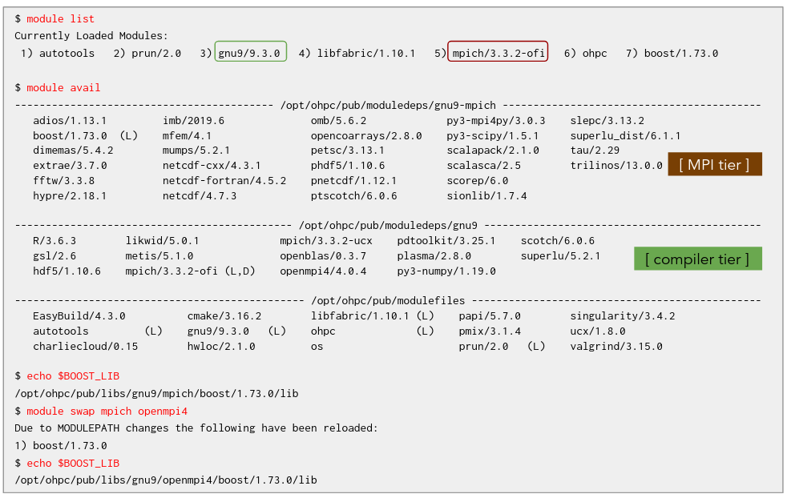

# Exercise 3: OpenHPC Software

As we discussed during the [introduction presentation](https://docs.google.com/presentation/d/1uCorXaj5Cz1qEJiCLzBSpeG0s1iFCqEmtTmDNIsmnEE),
OpenHPC is a software repository that is a series of building blocks. 
When we run OpenHPC in the cloud, we replace the provisioner (warewulf or xCAT) with packer and cloudformation. 
However, we still have the core of OpenHPC, the hierarchical software environment.

{: width="700px"}

## Working with the OpenHPC hierarchical software system (30 mins)

### The User Experience

OpenHPC provides a component hierarchy that is reflected in the user environment.

* The User interface to the OHPC software system is provided by [Lmod](https://lmod.readthedocs.io/en/latest/)
* End user sees compatible software based on the currently loaded environment
* Modulefiles for components relying on compiler/MPI variants leverage the “family” capability of Lmod
* If you switch to a different MPI variant, other related modules are updated automatically

{: width="700px"}

### Lmod Instantiation

### Setting Default Compiler and MPI Stack for Cluster

### Customizing Default Modules Loaded

### Working with Module Collections

